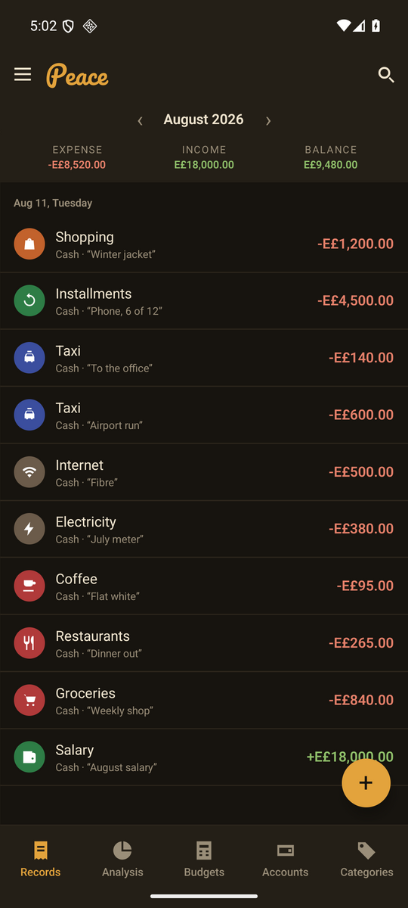
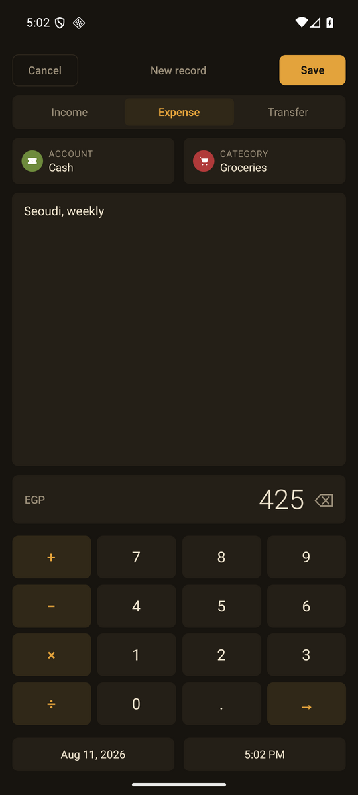
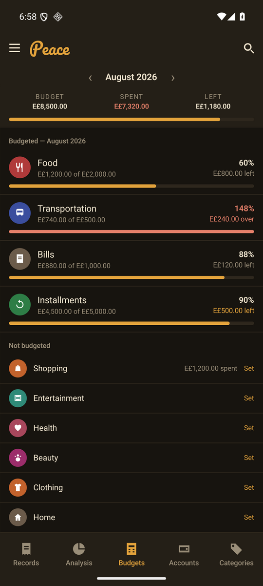
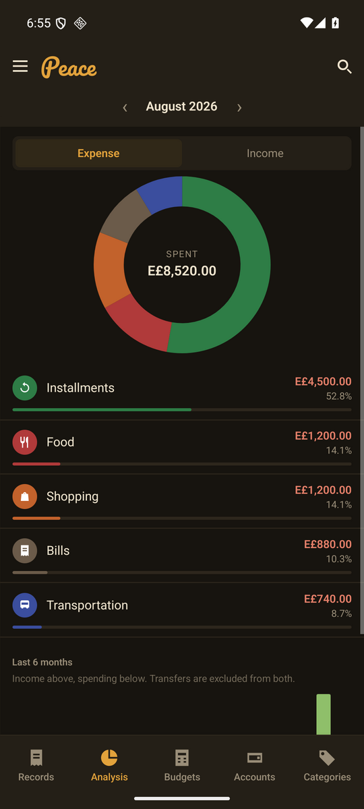
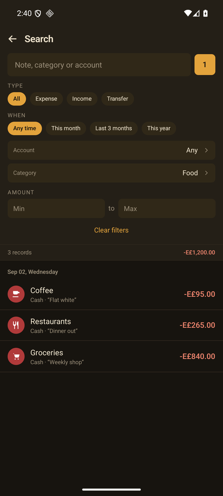

# Peace

A local-first expense tracker for Android. Peace of mind about where the money went.

Built because [MyMoney](docs/research/mymoney.md) gets the daily experience right but is missing
sub-categories, recurring payments, multi-currency, receipt attachments and any kind of assisted
entry. Peace keeps what works — the calculator keypad, the one-screen record form, the month as the
organising unit — and adds the rest.

**Local-first and offline.** Your ledger lives in SQLite on the device. There is no server, no
account, and no network dependency anywhere in the core product.

## Status

| Stage | Scope | State |
|---|---|---|
| 0 | Schema, design system, navigation shell, repository layer | ✅ done |
| 1 | Daily driver — records, calculator keypad, edit/delete, accounts & categories | ✅ done |
| — | App icon, side menu, search entry point (chrome, pulled ahead of Stage 2) | ✅ done |
| 2 | Budgets, analysis, search | ✅ done |
| — | Google Drive backup, sealed with a passphrase | ✅ done |
| — | Portfolio rebalancing | ✅ done |
| 3 | Recurring payments | ✅ done |
| 4 | Receipt attachments | ✅ done |
| 5 | Receipt OCR (Gemini) | ✅ done |
| 6 | Bank notification ingestion | ✅ done |

Full plan and the reasoning behind the ordering: [docs/roadmap.md](docs/roadmap.md).

Stage 1's finish line was never a feature list — it is *logging a real week of spending without
reaching for MyMoney*. **That test has been passed**: nine days of real records, and the only
things it turned up were a broken split-screen layout and a handful of papercuts, all since fixed.

**Every planned stage has shipped.** Voice entry was dropped from Stage 5 rather than deferred —
photographing a receipt answers the same question better, and a second capture path would have been
a second set of parsing rules to keep honest.

## Screens

<table>
<tr>
<td width="33%"></td>
<td width="33%"></td>
<td width="33%"></td>
</tr>
<tr>
<td><b>Records</b><br>The month is the organising unit. Transfers appear once, not twice, so the totals mean what they say — and each day's heading nets that day, which reconciles with <i>Now</i> above it.</td>
<td><b>One-handed entry</b><br>Pickers at the top, keypad at the bottom, and the bottom-right key walks the whole form — account, category, save. The camera and folder in the note's corner attach a receipt.</td>
<td><b>Budgets</b><br>A limit per category, suggested from what you actually spend. Spending under <i>Coffee</i> counts against <i>Food</i>.</td>
</tr>
<tr>
<td></td>
<td></td>
<td valign="top"></td>
</tr>
<tr>
<td><b>Analysis</b><br>Where it went, ranked. The percentages always total exactly 100 — three equal slices printing 33.3 apiece is how a money screen loses your trust.</td>
<td><b>Search</b><br>Free text across notes, categories and accounts, plus filters. It <i>totals</i> what it finds. Filtering by <i>Food</i> returns records filed under Groceries, Restaurants and Coffee.</td>
<td valign="top"></td>
</tr>
</table>

Screenshots are generated by `npm run shots`, not taken by hand, so they cannot quietly drift out of
date. The ledger in them is invented — this repository is public.

## What Peace does that MyMoney doesn't

Two different kinds of difference, kept apart on purpose.

### Gaps in MyMoney that Peace closes

Verified from screenshots of v6.6 and corroborated by its reviews — see
[docs/research/mymoney.md](docs/research/mymoney.md). Nothing here is a guess about a
competitor.

| Gap in MyMoney | Peace | State |
|---|---|---|
| **No sub-categories** — one flat level, its most-requested feature | Two-tier categories, enforced at the repository layer so a sub-category can never sprout children of its own | ✅ shipped |
| **No recurring transactions** — "Installments" is a *category*, re-typed by hand each month | Rules set while entering the record; occurrences proposed in the list and approved, edited or dismissed | ✅ shipped |
| **No receipt attachments** | Photograph or attach one per record, content-addressed and carried inside the backup | ✅ shipped |
| **No assisted entry** | Read a photographed receipt with Gemini and fill in the form | ✅ shipped |
| **No bank-message ingestion** — every record typed by hand | Bank SMS notifications are read and offered as records to approve | ✅ shipped |
| **No interest rate** on loan accounts | `interestRate` column exists on the schema | column only, no UI |
| **No multi-device sync** | Also none, deliberately — the ledger stays on the phone | by design |

### Choices Peace makes differently

Not claims about what MyMoney lacks — these are decisions about how this app should behave.

| | Why it exists |
|---|---|
| **One-handed entry** | The pickers sit at the top and the keypad at the bottom, so the bottom-right key walks the whole record — account, category, save. `=` still finishes a sum first, and the key's label says which of the three it will do. |
| **Split-screen as a supported layout** | Records get logged with a bank notification open beside the app, leaving ~340dp of height. The keypad is pinned and everything above it scrolls; below 520dp the pickers collapse to icons and the note joins them on one line. |
| **Per-record exchange rates** | A foreign purchase stores the settled amount, the rate used, *and* which home currency it was converted to. A purchase made when the dollar was fifty pounds stays at fifty forever. |
| **No invented cross-currency total** | Valuing a whole balance needs today's rate, and the only rates here belong to past records. The accounts screen shows one line per currency held rather than one authoritative-looking number. |
| **Undo after restoring a backup** | Restoring parks the previous state first, so recovering from a mistaken recovery is one tap. A backup you cannot get back out of is only half a safety net. |
| **CSV carries both legs of a transfer** | The records list hides one leg so a transfer doesn't look like double spending; the export is a copy of the ledger, so per-account balances in the file add up. |
| **No chart library** | The category ring is a few arc commands in `react-native-svg`, which every icon already uses. `victory-native` and `@shopify/react-native-skia` were dependencies nobody imported, and `librnskia.so` was 11.7 MB of a 58 MB APK. The arithmetic that replaced them is unit-tested — including that the percentages always total exactly 100, and that one category owning the whole month still draws a ring rather than nothing. |
| **Budgets that suggest themselves** | MyMoney's only way to start a month is "copy from past months", which is useless in the month you start — there is nothing to copy, so it opens on a blank screen asking for nineteen numbers you have no basis for. Peace offers a limit per category derived from what you actually spent, rounded up, and says whether it is averaging real months or falling back to this one. |
| **Search totals what it found** | Matching rows with no total leaves you adding them up by hand, and "how much did I spend on coffee" is the question behind most searches. The total is a separate aggregate over *every* match, so capping the list at 300 rows never changes the number above it. |
| **A parent category matches its children** | Filtering by "Food" returns the records filed under Coffee and Restaurants. Being told there are none, because they are all one level down, is the filter lying about the data. |
| **Refunds net against what they reverse** | Return E£800 of shoes and log it as Income — which is what a "Refunds" income category invites — and the month reports E£800 more income than you earned *and* E£800 more expense than you spent. The net is right, which is why the bug survives; every category breakdown is a lie. A refund in Peace is a positive amount on the expense side, so Clothing simply reads E£800 less. Long-press the purchase it reverses and the account and category come with it. |
| **A card reads as debt, not an emptied wallet** | A credit card at −E£5,000 is five thousand *owed*, shown unsigned beside the headroom left on its limit. The stored sign never changes, so net worth stays a plain sum across every account — this is the render boundary only. |
| **Balance corrections that are not spending** | Cards drift: the bank's rate differs, a fee posts, a record is missed. You type what the bank shows — outstanding *or* available, since banking apps disagree about which they display — and Peace writes a dated correction for the difference. It moves your balance and running total and never touches income, expense, budgets or the charts. Counting a correction as spending is what drops phantom expenditure into whichever month you happened to reconcile in. |
| **Card fees live on the card** | Credit limit, foreign-transaction fee and cash-withdrawal fee are per-account and optional, stored as basis points so a percentage never becomes a float multiplied by money. There is no "Kenana mode": one bank's rules baked into the app is a rule every other card then has to be excused from. |
| **Budgets have no carry-over** | An unspent limit rolling into next month is the feature MyMoney offers and Peace deliberately does not. A limit that gets easier every time you fail to use it is not a limit — and every question it forces (does it compound? does an overspend carry as a debt?) has no good answer, because the idea fights itself. What carries between months is *money*: the Records header's third cell reads **Now** — what you are actually holding — instead of this month's net, and that figure reconciles exactly with the Accounts total. |
| **Settings that do nothing are not shown** | A control for a preference nothing reads is a switch that silently does nothing, which is how an app teaches you to stop trusting it. Each row lands in the same change as the code that honours it. `viewMode` — a daily/weekly/yearly range — was declared early and **deleted rather than wired**: the app turned out to be month-shaped in a way it fought, since budgets are keyed by month and carry-forward runs month to month. A preference the design has outgrown is worse than none. |
| **The backup carries the receipts** | The moment a row can point at a file, the backup stops being the database. A Peace backup is a zip holding `peace.db` beside an `attachments/` folder — so it still opens without this app, which is why it was a bare `.db` to begin with. The manifest records how many receipts were packed and the restore *checks* it: a truncated archive still unzips, and restoring one would delete the originals and report success. |
| **Receipts are content-addressed** | A file is stored as `<sha256>.<ext>`, which buys three things at once: the same receipt attached twice is one file, a name a file manager supplied never reaches the disk or the archive, and a file cannot change under its own name. Two records can share one receipt, so deleting a row never deletes a file — only the ledger decides that. |
| **The model is a typist, not an accountant** | Gemini reads a receipt into *structured output*, never prose, and everything it returns is range-checked and dropped if it fails. A receipt whose date is unreadable but whose total is clear still fills in the total. Your API key lives in the device keystore, never in the settings table — that table travels inside every backup. |
| **The build identifies itself** | Settings → About shows `1.2.0 (build 116)` and the commit, marked `-dirty` if it was built from uncommitted code. |
| **Bank alerts are read, not your inbox** | Android hands over the notification the messaging app already showed — the same text you read off a lock screen. No `READ_SMS`, no conversation history, and nothing captured from any app but the one that owns SMS. The sender list **starts empty and reads nothing**, so granting the permission does not send every text you receive to Google. A captured message lands in the records list as a grey row like a recurring one, in no total, until you approve it. |
| **A notification's own timestamp beats a parsed date** | The model is never asked when a transaction happened. Android stamps the arrival to the second and a bank alert arrives when the money moves, so the exact answer is already in hand — where `13/08/2026` is a valid date under two conventions and picking the wrong one cannot be spotted afterwards. |
| **Daily totals net the day** | Each day's heading carries what that day did to your position. Transfers are left out — the day you moved savings across should not read like the day you spent them — and corrections are left in, because they moved real money. It uses the same home-currency expression as the month total above it, so the two cannot drift. |

Where Peace is still **behind**: nothing it set out to close.

## Stack

Expo SDK 57 · React Native 0.86 · React 19.2 · TypeScript · expo-router · NativeWind ·
Drizzle ORM + expo-sqlite · react-native-svg · fflate · Jest · Maestro

No chart library and no UI kit. Every icon and the category ring are hand-drawn SVG paths.

The one piece of native code is a **local Expo module** in [`modules/notification-listener/`](modules/notification-listener) —
a `NotificationListenerService` and about four functions. The third-party package for this was last
published well before SDK 57, and vendoring a fork would have been more code than writing it.

> **Expo has changed.** SDK 57 and RN 0.86 are newer than most training data and most tutorials.
> Read [the versioned docs](https://docs.expo.dev/versions/v57.0.0/) rather than writing APIs
> from memory. See [AGENTS.md](AGENTS.md).

## Getting started

The toolchain installs entirely under `$HOME` — no sudo, no system packages. See
[AGENTS.md](AGENTS.md) for the environment, and read its **memory** section before any native
build; this machine will OOM if you get the order wrong.

```bash
npm install
npm test              # unit tests, no device needed
npm run typecheck
npm run emu           # boot the headless Android emulator
npm start             # Metro dev server
```

| Task | Command |
|---|---|
| Unit tests | `npm test` |
| Typecheck / lint | `npm run typecheck` / `npm run lint` |
| Boot emulator | `npm run emu` |
| Screenshot the device | `npm run shot -- <name>` → prints a PNG path |
| E2E flows | `npm run e2e` |
| Standalone APK for a phone | `npm run apk` (arm64; `apk:emu` for x86_64) |
| Regenerate migrations | `npm run db:generate` |

### Installing on a phone

Distribution is **sideload only** — no Play Store, so no restricted-permission review.

**The APK is on the [Releases page](../../releases).** Every merge to `main` publishes a signed
arm64 build there. It upgrades an existing install in place — no uninstall, no data loss — because
every build is signed with the same key and carries an increasing `versionCode`.

> **Play Protect blocks this APK, and will keep blocking it.** Since Stage 6 the app declares a
> `NotificationListenerService`, and Google classes notification access — alongside `READ_SMS` and
> accessibility — as a sensitive permission that is **automatically blocked for sideloaded apps**.
> The dialog has no "Install anyway": it is a hard block, on every update rather than only the
> first.
>
> Two ways through, both on the phone's side rather than the app's:
>
> - `adb install -r peace-<version>-build<n>.apk` — a different install path, not subject to it.
> - Pause Play Protect (Play Store → profile → Play Protect → settings), install, switch it back on.
>
> **No manifest change avoids this while the feature exists** — the declaration *is* the capability.
> The only real escape is distributing through Play itself, and an internal testing track would do
> it: notification access is governed by the ordinary "necessary for core functionality" policy, not
> the near-total ban that applies to `READ_SMS`. Keeping that door open is exactly why this reads
> notifications rather than the inbox.

`npm run apk` builds the same thing locally at
`android/app/build/outputs/apk/release/app-release.apk`, with the JS bundle embedded so it runs
with no laptop attached. CI also attaches an APK to every PR, for testing a change before it lands.

### Versioning

| Field | Source | Changes |
|---|---|---|
| `version` | `app.json`, edited by hand | when you decide a release deserves a new number |
| `versionCode` | commit count | every commit |
| commit sha | git | every commit |

[`app.config.js`](app.config.js) layers the last two onto `app.json`. **Settings → About** shows
`1.2.0 (build 116)` and the commit, so "which build am I actually running" is answerable from the
phone. A build made from a tree with uncommitted changes is marked `-dirty`, since it cannot be
reproduced from its sha.

The commit count is what makes in-place upgrades work: Android requires a monotonically increasing
`versionCode`, and a commit count gives one for free without a "bump version" commit that would
itself change the number.

### Signing

Release builds are signed with a **private key**, not Expo's shared debug keystore. Android treats a
differently-signed APK as a different app, so this identity must stay stable: lose the key and you
can never ship an update that upgrades an existing install.

- Keystore lives at `~/keystores/peace-release.jks`, outside the repository. **Back it up.**
- Credentials are Gradle properties in `~/.gradle/gradle.properties` (`PEACE_STORE_FILE`,
  `PEACE_STORE_PASSWORD`, `PEACE_KEY_ALIAS`, `PEACE_KEY_PASSWORD`), and GitHub secrets for CI.
- [`plugins/with-release-signing.js`](plugins/with-release-signing.js) wires them in. It is a
  config plugin because `expo prebuild` regenerates `android/`.
- **Missing credentials fall back to debug signing** rather than failing, so a fresh clone — or a
  PR from a fork, which cannot read secrets — still builds a working APK. It just is not
  upgrade-compatible with the signed one.

On a new machine, restore the `.jks` and re-add those four properties; nothing else is needed.

## Continuous integration

Every PR to `main` runs [`.github/workflows/pr.yml`](.github/workflows/pr.yml):

| Job | What it does |
|---|---|
| `check` | typecheck, lint, unit tests — about a minute, so it fails fast |
| `apk` | `expo prebuild` + Gradle release build, uploaded as a downloadable artifact |

Merging to `main` runs [`release.yml`](.github/workflows/release.yml), which repeats those checks
and publishes a GitHub Release tagged `v<version>+build.<n>` with the APK attached. Every merge so
far has produced one, and installing from the Releases page is the normal way to get a build onto a
phone.

Both workflows call the **same** reusable build
([`build-apk.yml`](.github/workflows/build-apk.yml)) rather than keeping two copies of the steps —
a release built by a drifting second copy would not be the artifact that was reviewed.

`android/` is gitignored and generated from `app.json` plus the config plugins, so CI runs
`prebuild` itself rather than checking it out.

**Maestro flows do not run in CI** — they need a booted emulator, which is slow and flaky on
hosted runners. Run them locally with `npm run e2e` before merging anything that touches a screen.

## Layout

```
src/app/               expo-router routes
src/app/(drawer)/      side menu wrapped around...
src/app/(tabs)/          ...the five tabs. Both are groups, so URLs are unchanged.
src/components/        shared UI (screen chrome, icon set, drawer content)
src/constants/         palette.js — the single source of colour truth
src/db/                schema, client, migrations provider, seed
src/db/repo/           the ONLY place that writes to the database
src/lib/               pure logic — money, periods, calculator, receipt parsing. Tests live here.
src/state/             cross-screen state (settings cache, undo, Drive and bank catch-up)
src/test/              test helpers (in-memory database from real migrations)
assets/logo/           source SVGs for the app icon (PNGs are generated)
scripts/               emulator, screenshots, icon generation
modules/               local native modules (the notification listener)
drizzle/               generated migrations (committed)
docs/                  research, roadmap, design system
.maestro/              E2E flows
```

## Rules that are not negotiable

These exist because breaking them corrupts a ledger quietly, which is the worst way to fail.

1. **Money is integer minor units.** `amount_minor` is a signed integer; negative is money out.
   Never store or do arithmetic on money as a float. Convert only at the render boundary, via
   [`src/lib/money.ts`](src/lib/money.ts).

2. **All writes go through `src/db/repo/`.** SQLite cannot express "categories are two levels
   deep" or "a transfer is two rows"; the repository can, and it is tested.

3. **Transfers are two rows** sharing a `transfer_pair_id`, written in one SQL transaction. Per-
   account balance stays a plain `SUM(amount_minor)`. Every query must render only the outgoing
   leg, and exclude transfers from income and expense totals — a transfer is neither.

4. **Balances are derived, never stored.** A stored running total is one missed update away from
   disagreeing with the ledger, with no way to tell afterwards which is right.

5. **Colour is never the only signal.** Every amount carries an explicit `+` or `−`. Roughly one
   man in twelve has red-green colour deficiency and the amount is the most important thing on
   screen. See [docs/design-system.md](docs/design-system.md).

6. **`Intl` on Hermes is not `Intl` on Node, and it fails silently.** A green `npm test` proves
   nothing about currency or date rendering. Check it with a screenshot on a device.

7. **Add a `testID` to anything a flow needs to find.** Maestro matches on it; labels get reworded.

## Documentation

| Document | What it holds |
|---|---|
| [AGENTS.md](AGENTS.md) | Toolchain, verification workflow, environment constraints and the OOM traps |
| [docs/roadmap.md](docs/roadmap.md) | Six stages, dependencies, and the decisions already made |
| [docs/research/mymoney.md](docs/research/mymoney.md) | The reference app, from screenshots of v6.6 |
| [docs/design-system.md](docs/design-system.md) | The "Ledger" palette, its rules, the app icon, and split-screen density |
| [docs/research/credit-cards.md](docs/research/credit-cards.md) | Why card accounts drift, and the proposed fix |

Keep these current. They are the reason a new session can pick the work up without re-deriving
decisions that were already made and paid for.
